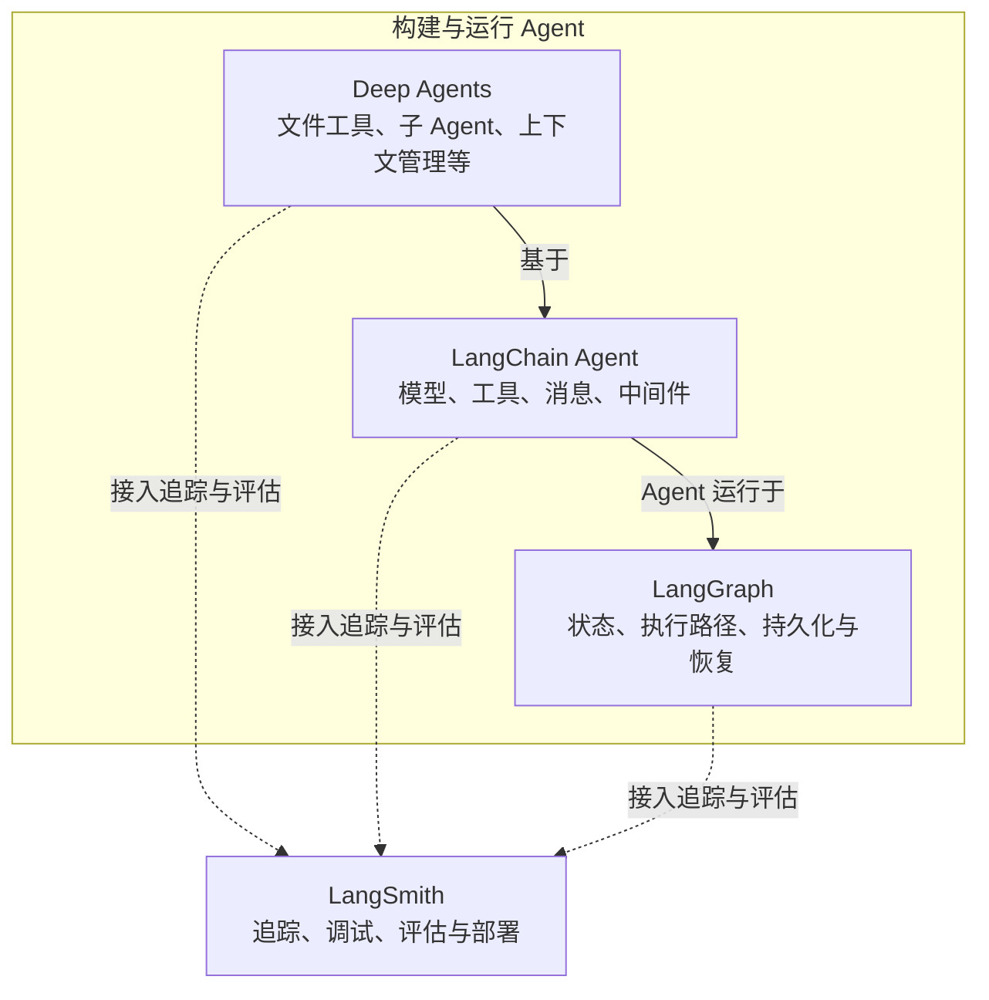
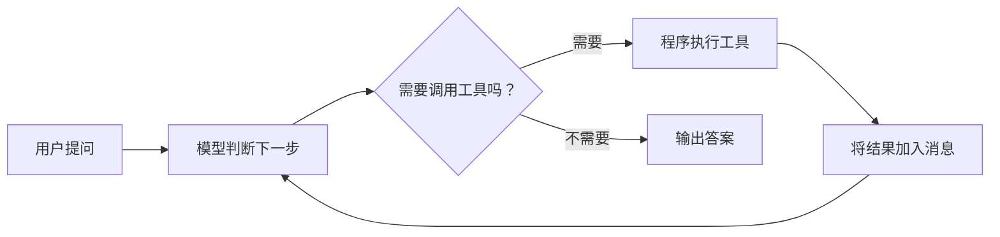
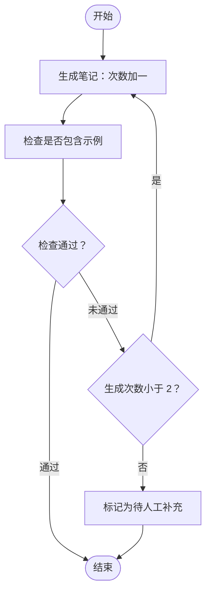
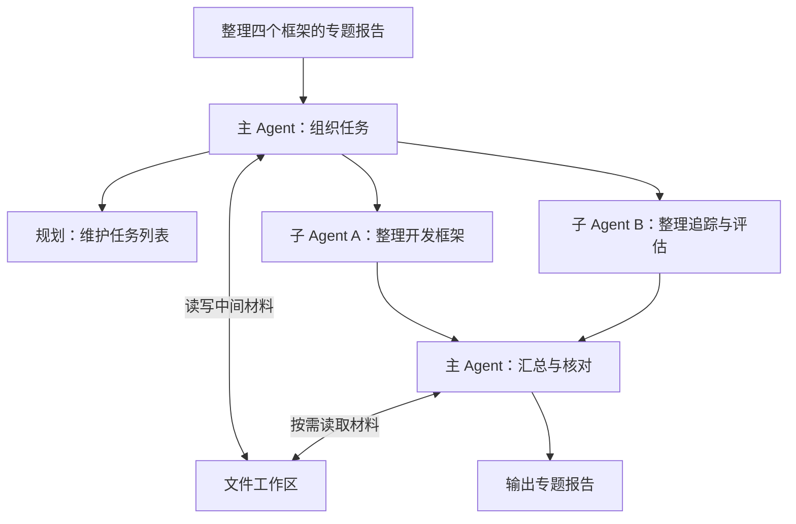
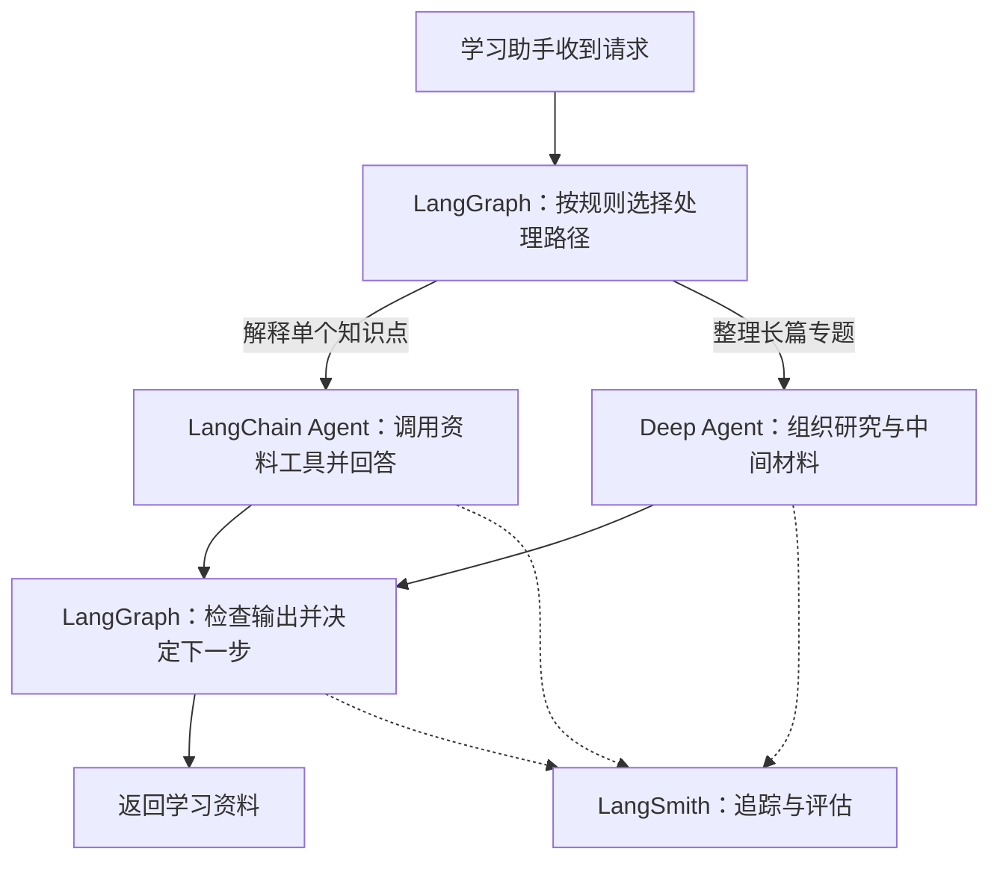

# LangChain 家族四大支柱：从一个学习助手理解整个生态

> 阅读目标：能说清楚四者分别解决什么问题、如何配合，以及什么时候需要它们。
>
> 资料核对日期：2026-09-23。本文以 Python 和 LangChain 1.x 为背景；当前项目安装了 `langchain 1.4.2`、`langgraph 1.2.12`、`langsmith 0.14.0`，尚未安装 `deepagents`。官方通常将 Deep Agent 这一产品称为 **Deep Agents**，Python 包名是 `deepagents`。

## 1. 先看全景：四个名字，四种职责

假设我们要做一个 **AI 学习助手**，它能查课程资料、解释知识点、整理笔记，并逐步完成一份专题研究报告。

| 名称 | 它主要解决的问题 | 在学习助手中的例子 | 一句话记忆 |
| --- | --- | --- | --- |
| **LangChain** | 如何接入模型、工具，并构建可定制的 Agent？ | 模型调用“查课程资料”工具，再用资料回答问题 | 把模型与工具组织起来 |
| **LangGraph** | 如何明确控制多步骤任务的状态、分支、循环和恢复？ | 写笔记 → 检查 → 不合格则重写，超出次数则交给人工 | 把执行流程管起来 |
| **Deep Agents** | 如何快速具备处理复杂任务的 Agent 配套能力？ | 拆解研究任务、委派子 Agent、把材料存为文件、汇总报告 | 把复杂任务的常用能力装配好 |
| **LangSmith** | 如何知道系统做了什么、哪里失败、改动是否有效？ | 查看检索和模型调用，比较两个版本的回答质量 | 把运行过程和效果看清楚 |

更准确地说，前三者属于开源开发栈的不同层次；**LangSmith 是开发与运维平台**，提供追踪、评估、提示词管理、部署等能力。它们的关系可以这样理解：[官方开发栈概览](https://www.langchain.com/oss-overview)、[LangGraph 概览](https://docs.langchain.com/oss/python/langgraph/overview)。



实线表达开发栈关系，虚线表达可选的平台集成。这里的层次关系特指 Agent 栈：LangChain 也有可单独使用的模型、消息等组件；LangGraph 也可以直接编写节点，不要求先使用 LangChain 的 `create_agent`。[LangChain 概览](https://docs.langchain.com/oss/python/langchain/overview)、[LangGraph 概览](https://docs.langchain.com/oss/python/langgraph/overview)。

> 如果 Markdown 阅读器不支持 Mermaid，可以先记住文字版：**Deep Agents → LangChain Agent → LangGraph；LangSmith 横向观察和评估这些应用。**

## 2. 补齐三个基础概念

### 2.1 大模型、工具与 Agent

**大模型（LLM）** 根据输入生成输出。它可以提出“需要查询资料”，实际查询由应用程序执行。

**工具（Tool）** 是暴露给模型使用的能力，例如 Python 函数、数据库查询或搜索接口。名称、参数类型和描述帮助模型决定何时调用它。

**Agent** 将模型和执行机制组织成一个循环：模型判断下一步，程序执行工具，再把结果交回模型，直到得到答案或达到停止条件。[LangChain Agents](https://docs.langchain.com/oss/python/langchain/agents)。



例如用户问：“我们课程里的 LangGraph 主要学什么？”可能发生：

1. 模型生成工具调用：`lookup_topic(topic="LangGraph")`。
2. Python 程序执行函数，取回课程内容。
3. 模型读到结果，组织成适合初学者的解释。

### 2.2 Workflow 与 Agent 的差别

| 方式 | 下一步主要由谁决定？ | 学习助手的例子 |
| --- | --- | --- |
| **工作流（Workflow）** | 开发者定义的规则和路径 | 必须先查资料、再写笔记、最后做格式检查 |
| **Agent** | 模型根据当前信息动态决定 | 模型决定先查 LangChain，还是继续查询 LangGraph |

实际应用可以混合两者：外层工作流规定“提交前必须通过检查”，内部 Agent 自主选择检索哪些资料。LangGraph 可以承载这种组合。[LangGraph 概览](https://docs.langchain.com/oss/python/langgraph/overview)。

### 2.3 Harness 是什么？

可以把 **Agent harness** 理解为“让模型持续完成任务的配套运行机制”：包括工具、提示词、上下文整理、任务委派等。LangChain 让我们按需组装这些机制；Deep Agents 提供更多已经装配好的能力。[官方开发栈概览](https://www.langchain.com/oss-overview)。

## 3. LangChain：让模型能够使用工具

### 3.1 核心能力

LangChain 提供模型和工具的统一抽象，并通过 `create_agent` 构建标准的工具调用循环。常见组成如下：[LangChain 概览](https://docs.langchain.com/oss/python/langchain/overview)。

| 组成 | 含义 | 学习助手中的对应物 |
| --- | --- | --- |
| Model | 负责理解输入、生成回答和选择工具的模型 | 一个支持工具调用的聊天模型 |
| Messages | 用户、模型、工具之间交换的信息 | 问题、检索结果、最终解释 |
| Tools | 模型可请求调用的外部能力 | `lookup_topic` 课程资料查询 |
| System prompt | 规定角色、目标和回答要求 | “用中文解释，提供一个例子” |
| Middleware | 在模型或工具调用前后加入处理逻辑 | 调整上下文、限制调用次数、加入人工审核 |

统一接口减少接入差异，但具体模型是否支持工具调用、支持哪些参数，仍取决于对应模型和集成。[LangChain Agents](https://docs.langchain.com/oss/python/langchain/agents)。

### 3.2 例子：查课程资料后回答

下面是需要真实模型服务的完整示例。为便于理解，资料查询使用内存字典；它没有联网搜索，也没有连接向量数据库。

运行准备：在项目根目录执行 `uv add langchain-openai`，设置 `OPENAI_API_KEY`，再把 `OPENAI_MODEL` 设置为你账号可用、支持工具调用的模型 ID。示例从环境变量读取这些配置，避免把密钥写入笔记或代码。

```python
import os

from langchain.agents import create_agent
from langchain.tools import tool
from langchain_openai import ChatOpenAI


@tool
def lookup_topic(topic: str) -> str:
    """查询课程主题简介；topic 可取 LangChain 或 LangGraph。"""
    lessons = {
        "LangChain": "学习模型、消息、工具，以及 Agent 的工具调用循环。",
        "LangGraph": "学习状态、节点、边，以及带分支和循环的工作流。",
    }
    return lessons.get(topic, "课程资料中没有该主题，请明确说明资料不足。")


model = ChatOpenAI(model=os.environ["OPENAI_MODEL"])
agent = create_agent(
    model=model,
    tools=[lookup_topic],
    system_prompt="你是中文学习助手。回答课程内容前先查工具，再举一个例子。",
)

result = agent.invoke({
    "messages": [{"role": "user", "content": "课程里的 LangGraph 主要学什么？"}]
})
print(result["messages"][-1].content)
```

重点看四处：

- `@tool`：把普通函数声明成模型可以调用的工具。
- `create_agent`：装配模型、工具和提示词，准备执行循环。
- `invoke`：执行一次请求；内部可能发生多轮模型和工具调用。
- `messages`：保存这次执行中的消息，最后一条通常是最终回答。

预期会得到“状态、节点、边”的解释和例子；措辞与实际调用路径可能变化。提示词表达的是行为要求；如果“必须先查询”是不可跳过的规则，可以用明确的工作流或中间件落实。API 用法参见 [Agents](https://docs.langchain.com/oss/python/langchain/agents) 和 [create_agent 参考](https://reference.langchain.com/python/langchain/agents/factory/create_agent)。

**适用场景：** 问答助手、查资料助手，以及围绕“模型判断 → 调用工具 → 继续判断”循环的可定制 Agent。

## 4. LangGraph：明确规定任务如何流转

### 4.1 为什么还需要一张图？

现在需求升级：

> 帮我写一份学习笔记。每份笔记必须包含例子；没有例子就重写，最多生成两次，仍不合格则标记为待人工补充。

这时我们关心的不只是“模型能不能回答”，还包括：当前是第几次生成？检查结果是什么？接下来应该重写还是结束？

LangGraph 用 **状态、节点和边** 表达这些规则。[Graph API](https://docs.langchain.com/oss/python/langgraph/graph-api)。

| 概念 | 含义 | 本例中的内容 |
| --- | --- | --- |
| **State（状态）** | 流程中传递和更新的数据 | 主题、尝试次数、笔记正文、检查结果 |
| **Node（节点）** | 一个处理步骤，可以是普通函数，也可以调用模型或 Agent | 写笔记、检查笔记、标记待补充 |
| **Edge（边）** | 决定节点之间如何流转 | 写完后检查；失败后按次数决定去向 |
| **Checkpoint（检查点）** | 配置 checkpointer 后保存的图状态快照 | 记录某次运行进行到了什么位置 |



图中的菱形展示条件边的判断逻辑，在代码中可以由一个路由函数完成，不一定分别创建成节点。

### 4.2 一个不需要 API Key 的可运行例子

这个例子使用普通函数模拟笔记生成，专门观察**状态更新、条件分支和循环**。它没有调用大模型。当前项目已安装 LangGraph，可以把代码保存为临时 `.py` 文件，再用 `uv run 文件路径` 执行。

```python
from typing import TypedDict

from langgraph.graph import END, START, StateGraph


class NoteState(TypedDict):
    topic: str
    attempts: int
    draft: str
    passed: bool


def write_note(state: NoteState) -> dict:
    attempts = state["attempts"] + 1
    if state["topic"] == "LangGraph":
        draft = "LangGraph 使用状态、节点和边组织流程。"
        if attempts >= 2:
            draft += "\n示例：笔记检查不通过时，回到生成节点重写。"
    else:
        draft = "尚未找到该主题的课程资料。"
    return {"attempts": attempts, "draft": draft}


def check_note(state: NoteState) -> dict:
    # 教学用的简化规则，只检查标记；不代表内容质量评估。
    return {"passed": "示例：" in state["draft"]}


def route_after_check(state: NoteState) -> str:
    if state["passed"]:
        return "done"
    return "retry" if state["attempts"] < 2 else "review"


def mark_for_review(state: NoteState) -> dict:
    return {"draft": "[待人工补充] " + state["draft"]}


builder = StateGraph(NoteState)
builder.add_node("write", write_note)
builder.add_node("check", check_note)
builder.add_node("review", mark_for_review)
builder.add_edge(START, "write")
builder.add_edge("write", "check")
builder.add_conditional_edges(
    "check", route_after_check,
    {"done": END, "retry": "write", "review": "review"},
)
builder.add_edge("review", END)
graph = builder.compile()

result = graph.invoke({
    "topic": "LangGraph", "attempts": 0, "draft": "", "passed": False,
})
print("生成次数：", result["attempts"])
print(result["draft"])
```

预期输出：

```text
生成次数： 2
LangGraph 使用状态、节点和边组织流程。
示例：笔记检查不通过时，回到生成节点重写。
```

把输入主题改成 `"未知主题"`，两次生成后会输出带 `[待人工补充]` 的文本。这是有上限的失败出口。

注意，节点返回的是**局部状态更新**。例如 `check_note` 只更新 `passed`，不会清空 `topic` 和 `draft`；这里的普通字段默认使用新值覆盖旧值，列表累加等行为可另行配置 reducer（合并规则）。[Graph API](https://docs.langchain.com/oss/python/langgraph/graph-api)。

### 4.3 状态不等于自动持久化

上面的例子只在一次调用内流转状态，也只是给结果加上“待人工补充”标签。它没有实现真正的暂停审批或跨进程恢复。

要继续扩展，可以加入：

- **Checkpointer + `thread_id`**：保存并定位同一条执行线程的状态，用于继续对话和恢复；跨进程保存需要持久存储实现，内存实现会随进程退出而丢失。
- **`interrupt` + `Command(resume=...)`**：在配置检查点的流程中暂停，收到人工输入后继续。
- **Store**：保存跨线程共享的信息，例如用户长期偏好的学习方式。

这些机制分别对应“本次任务做到哪里”和“跨任务需要记住什么”。[持久化文档](https://docs.langchain.com/oss/python/langgraph/persistence)、[中断文档](https://docs.langchain.com/oss/python/langgraph/interrupts)。

**适用场景：** 需要明确控制分支、重试、人工介入和长时间运行的任务。简单工作流用普通 Python 函数也能完成；当这些控制需求增多时，LangGraph 的价值更明显。

## 5. Deep Agents：为复杂任务提供配套能力

### 5.1 从回答一个问题，到完成一项研究

再把需求升级：

> 阅读四个框架的资料，分别整理用途和代码例子，比较差异，最后写成一份专题报告。资料很多时保存中间笔记，避免遗漏。

我们当然可以自己使用 LangChain 和 LangGraph 逐项实现这些能力。Deep Agents 则在这个开发栈上封装了文件操作、子 Agent、上下文管理等常见机制，入口是 `create_deep_agent`。[Deep Agents 概览](https://docs.langchain.com/oss/python/deepagents/overview)。

| 能力 | 解决的问题 | 学习助手中的用法 |
| --- | --- | --- |
| 任务规划与跟踪 | 多步骤工作容易漏项 | 建立“查资料、做比较、写报告”的待办列表 |
| 文件工具 | 大段资料不适合一直塞在对话里 | 把摘录保存到工作区，需要时再读取 |
| 子 Agent | 某个子任务需要独立处理大量信息 | 委派一个子 Agent 专门整理 LangGraph |
| 上下文管理 | 对话和工具结果不断增长 | 摘要历史、把大结果移出当前上下文 |

其中，文件后端决定文件存在哪里，子 Agent 通常在独立上下文中工作，再返回结果；这些机制帮助控制信息规模，并不保证研究结论自动正确。[文件后端](https://docs.langchain.com/oss/python/deepagents/backends)、[子 Agent](https://docs.langchain.com/oss/python/deepagents/subagents)、[上下文管理](https://docs.langchain.com/oss/python/deepagents/context-engineering)。



这是一个**可以设计出的执行过程**；并非每次调用都一定启动两个子 Agent，实际行为取决于任务、模型、提示词和配置。

### 5.2 代码入口与规划能力

以下是接在第 3 节的模型和工具定义后面的装配示意。额外需要安装 `deepagents`；仍需要模型服务配置。

```python
from deepagents import create_deep_agent
from langchain.agents.middleware import TodoListMiddleware

# 复用第 3 节的 model 和 lookup_topic；这是装配示意，不是独立脚本。
research_agent = create_deep_agent(
    model=model,
    tools=[lookup_topic],
    middleware=[TodoListMiddleware()],
    system_prompt=(
        "你是学习资料整理助手。先规划，再按需查询课程资料，"
        "整理 LangChain 与 LangGraph 的区别；资料不足时明确说明。"
    ),
)
```

`TodoListMiddleware` 给 Agent 提供结构化待办工具。**按当前官方文档，Deep Agents 从 v0.7 起需要显式启用这项规划能力，早期版本曾默认内置。** 因此，“Deep Agents 支持规划”和“所有版本默认开启规划”要分开理解。[任务规划说明](https://docs.langchain.com/oss/python/deepagents/overview#task-planning)。

本例只提供一个查询两条课程简介的工具，足以展示装配方法。要完成前面的真实研究任务，还需要接入相应的文档读取或搜索工具。

### 5.3 三个容易误解的地方

- **Deep 不表示训练了一个更大的模型。** 它描述的是 Agent 的任务处理机制；底层模型仍由我们选择。
- **虚拟文件不等于本机文件。** 默认的状态后端与本机磁盘是不同存储方式；文件是否跨调用、跨线程或跨进程保留，取决于后端及持久化配置。[后端说明](https://docs.langchain.com/oss/python/deepagents/backends)。
- **保存记忆不等于训练模型权重。** 系统可以把偏好存下来、在后续请求中读取；这是管理应用数据和上下文。[记忆说明](https://docs.langchain.com/oss/python/deepagents/memory)。

**适用场景：** 研究报告、代码任务、跨文档分析等需要多步骤协作和上下文整理的工作。对于只调用一次工具的问题，是否引入这些能力可以按需求决定。

## 6. LangSmith：知道系统做了什么，以及做得好不好

### 6.1 Trace：一次请求内部发生了什么？

假设学习助手答错了。仅看最终文本，很难判断是工具没找到资料、模型没调用工具，还是模型读到了资料却理解错了。

LangSmith 的 **Trace（执行轨迹）** 可以把一次请求内的操作串起来。单次操作通常称为 run，多个 run 可以组成父子结构。下面是教学示意，并非实际采集记录：[可观测性文档](https://docs.langchain.com/langsmith/observability)。

```text
请求：解释课程中的 LangGraph
└── 学习助手运行
    ├── 模型调用 1
    │   └── 输出工具请求：lookup_topic("LangGraph")
    ├── 工具调用：lookup_topic
    │   └── 返回：状态、节点、边……
    └── 模型调用 2
        └── 输出：最终解释与例子
```

通过这些记录，我们可以定位工具输入输出、错误和耗时，并在集成支持时查看 token 使用等信息。例如：如果工具返回了“没有该主题”，就应先检查检索路径和数据；如果工具返回正确而答案错误，就继续检查模型收到的上下文和生成要求。

Trace 记录的是可观测到的调用和数据，不能把它当作模型内部完整的隐藏思考过程。

### 6.2 Evaluation：修改后真的更好了吗？

一次回答正确，不代表换一个问题还正确。可以为学习助手准备一个小型评估数据集：

| 测试问题 | 期望满足的标准 |
| --- | --- |
| LangGraph 中的 State 是什么？ | 解释流程数据，并给出具体字段例子 |
| LangSmith 能直接代替聊天模型吗？ | 能区分平台与模型的职责 |
| 请介绍资料中不存在的课程 | 明确说明缺少资料，避免编造 |

然后让提示词 A、提示词 B 在同一组问题上运行，比较正确性、例子完整度、延迟等指标。评判可以采用代码规则、人工审核或模型评分；模型评分本身也需要检查可靠性。

LangSmith 支持开发阶段的**离线评估**，也支持对实际用户交互进行**在线评估**。这里的“离线”指使用预先准备的数据集进行实验，不表示整个过程无需联网。[评估文档](https://docs.langchain.com/langsmith/evaluation)、[评估类型](https://docs.langchain.com/langsmith/evaluation-types)。

### 6.3 如何接入追踪？

对于已集成追踪的 LangChain / LangGraph 应用，通常可以通过环境变量启用：

```bash
export LANGSMITH_TRACING=true
export LANGSMITH_API_KEY="替换为你的 LangSmith API Key"
export LANGSMITH_PROJECT="langchain-family-learning"
```

在设置好变量的同一终端运行程序，执行记录便会发送到对应 LangSmith 服务。非默认服务区域还需按文档配置 `LANGSMITH_ENDPOINT`。LangSmith 的密钥与模型供应商的密钥用途不同。[Tracing quickstart](https://docs.langchain.com/langsmith/observability-quickstart)。

LangSmith 也支持其他框架；对普通 Python 函数或其他模型 SDK，需要使用相应集成、包装器或 `@traceable` 等方式埋点，设置环境变量本身不会自动捕获任意代码。[可观测性文档](https://docs.langchain.com/langsmith/observability)、[Tracing quickstart](https://docs.langchain.com/langsmith/observability-quickstart)。

**适用场景：** 排查错误、观察性能、比较模型或提示词版本。它可以从第一个小应用开始接入，不必等到使用 Deep Agents 后才学习。

## 7. 同一个产品，如何组合四者？

下面是一种可能的设计：



这张图表达**业务组合**：外层 LangGraph 节点可以调用一个 LangChain Agent 或 Deep Agent。它与第 1 节的底层依赖关系并不冲突。

实际项目只需选择当前需要的能力：

| 当前需求 | 可以从哪里开始 |
| --- | --- |
| 一次输入、一次模型输出 | 模型 SDK，或 LangChain 的模型接口 |
| 自定义模型与工具调用循环 | LangChain `create_agent` |
| 需要自己掌握状态、分支和循环 | LangGraph |
| 希望直接使用文件、子 Agent、上下文管理等能力 | Deep Agents |
| 想排查调用过程或衡量改动效果 | 为现有应用接入 LangSmith |

这些选择可以组合，也可以随着需求演进调整。Deep Agents 封装了更多能力，并不意味着它适合所有任务，或能消除工具、模型和数据本身的错误。

## 8. 建议的学习顺序与自测

针对本项目“先理解基础”的目标，可以按以下顺序练习：

1. **理解模型与工具**：读懂第 3 节，分清模型提出调用与程序执行调用。
2. **跑通 LangGraph 小例子**：观察两次生成，再改成未知主题，观察失败出口。
3. **理解 LangSmith 的 Trace**：能画出一次提问中模型和工具的调用树。
4. **研究 Deep Agents**：带着“谁规划、材料存哪里、子任务如何返回”的问题阅读文档。

这是为了拆解概念而安排的学习顺序。开发实际产品时，也可以直接从 Deep Agents 入手，再按定制需求学习更底层的机制。[官方开发栈概览](https://www.langchain.com/oss-overview)。

用下面四个问题检查自己是否理解：

1. **模型生成 `lookup_topic(...)`，函数就会自己运行吗？** 需要 Agent 的执行程序接收调用、运行函数并回传结果。
2. **工作流会分支、会循环，就一定使用了多个 Agent 吗？** 不一定；第 4 节只有普通 Python 函数，也能分支和循环。
3. **把内容写入 Deep Agents 的文件工具，重启进程后一定还在吗？** 要看后端和持久化配置。
4. **Trace 看起来每一步都成功，回答就一定正确吗？** 调用成功与内容正确是两件事，还需要评估标准。

## 9. 继续阅读

| 方向 | 官方资料 |
| --- | --- |
| 整体关系 | [开源 Agent 开发栈](https://www.langchain.com/oss-overview) |
| LangChain | [概览](https://docs.langchain.com/oss/python/langchain/overview) · [Agents](https://docs.langchain.com/oss/python/langchain/agents) |
| LangGraph | [概览](https://docs.langchain.com/oss/python/langgraph/overview) · [Graph API](https://docs.langchain.com/oss/python/langgraph/graph-api) · [持久化](https://docs.langchain.com/oss/python/langgraph/persistence) |
| Deep Agents | [概览](https://docs.langchain.com/oss/python/deepagents/overview) · [快速开始](https://docs.langchain.com/oss/python/deepagents/quickstart) · [后端](https://docs.langchain.com/oss/python/deepagents/backends) |
| LangSmith | [追踪](https://docs.langchain.com/langsmith/observability-quickstart) · [评估](https://docs.langchain.com/langsmith/evaluation) |

本文的学习助手场景与示例数据均为教学设计。LangGraph 示例可离线运行；LangChain 示例需要额外集成包和真实模型配置；Deep Agents 代码展示装配入口，不是一套完整研究系统。
